> 在线视频：[尚硅谷Nginx教程由浅入深（一套打通丨初学者也可掌握）](https://www.bilibili.com/video/BV1zJ411w7SV)
>
> 课堂资料：[尚硅谷Nginx教程](https://pan.baidu.com/s/1yURU7uHe8pLeQlslZ0Cqbw?pwd=yyds )
>
> 代码仓库
>
> Gitee: https://gitee.com/an_shiguang/learn-nginx
>
> GitHub: https://github.com/Shiguang-coding/learn-nginx

# Nginx介绍

## Nginx概述

Nginx("engine x")是一个高性能的HTTP和反向代理服务器，特点是占有内存少，并发能力强，事实上nginx的并发能力确实在同类型的网页服务器中表现较好，中国大陆使用nginx网站用户有：百度、京东、新浪、网易、腾讯、淘宝等。

## Nginx作为web服务器

> https://lnmp.org/nginx.html

Nginx可以作为静态页面的web服务器，同时还支持CGI协议的动态语言，比如perl、php等。但是不支持java。Java程序只能通过与tomcat配合完成。Nginx专为性能优化而开发，性能是其最重要的考量，实现上非常注重效率，能经受高负载的考验，有报告表明能支持高达50,000个并发连接数。


## 正向代理

> 在客户端（浏览器）配置代理服务器，通过代理服务器进行互联网访问

Ngx不仅可以做反向代理，实现负载均衡。还能用作正向代理来进行上网等功能。

正向代理：如果把局域网外的nternet想象成一个巨大的资源库，则局域网中的客户端要访问Internet,,则需要通过代理服务器来访问，这种代理服务就称为正向代理。


## 反向代理

反向代理，其实客户端对代理是无感知的，因为客户端不需要任何配置就可以访问，<font color = 'red'>我们只需要将请求发送到反向代理服务器，由反向代理服务器去选择目标服务器获取数据后，再返回给客户端</font>，此时反向代理服务器和目标服务器对外就是一个服务器，暴露的是代理服务器地址，隐藏了真实服务器IP地址。


## 负载均衡

客户端发送多个请求到服务器，服务器处理请求，有一些可能要与数据库进行交互，服务器处理完毕后，再将结果返回给客户端。

这种架构模式对于早期的系统相对单一，并发请求相对较少的情况下是比较适合的，成本也低。但是随着信息数量的不断增长，访问量和数据量的飞速增长，以及系统业务的复杂度增加，这种架构会造成服务器相应客户端的请求日益缓慢，并发量特别大的时候，还容易造成服务器直接崩溃。很明显这是由于服务器性能的瓶颈造成的问题，那么如何解决这种情况呢？

我们首先想到的可能是升级服务器的配置，比如提高CPU执行频率，加大内存等提高机器的物理性能来解决此问题，但是我们知道摩尔定律的日益失效，硬件的性能提升已经不能满足日益提升的需求了。最明显的一个例子，天猫双十一当天，某个热销商品的瞬时访问量是极其庞大的，那么类似上面的系统架构，将机器都增加到现有的顶级物理配置，都是不能够满足需求的。那么怎么办呢？

上面的分析我们去掉了增加服务器物理配置来解决问题的办法，也就是说纵向解决问题的办法行不通了，那么横向增加服务器的数量呢？这时候集群的概念产生了，单个服务器解决不了，我们增加服务器的数量，然后将请求分发到各个服务器上，将原先请求集中到单个服务器上的情况改为将请求分发到多个服务器上，将负载分发到不同的服务器，也就是我们所说的**负载均衡**


## 动静分离

为了加快网站的解析速度，可以把动态页面和静态页面由不同的服务器来解析，加快解析速度。降低原来单个服务器的压力。


# Nginx安装

## 下载资源包

> Nginx官网： http://nginx.org/

需要的素材

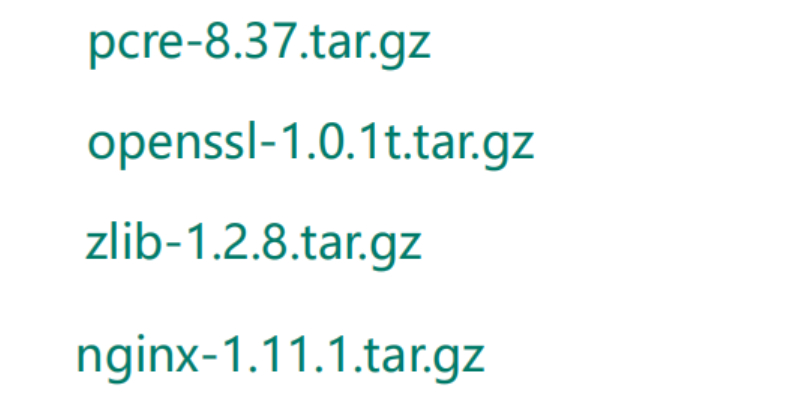

## 安装Nginx

### 第一步，安装pcre依赖

1、下载pcre依赖包

```bash
wget http://downloads.sourceforge.net/project/pcre/pcre/8.37/pcre-8.37.tar.gz
```

2、解压文件

```bash
tar -vxf pcre-8.37.tar.gz
```

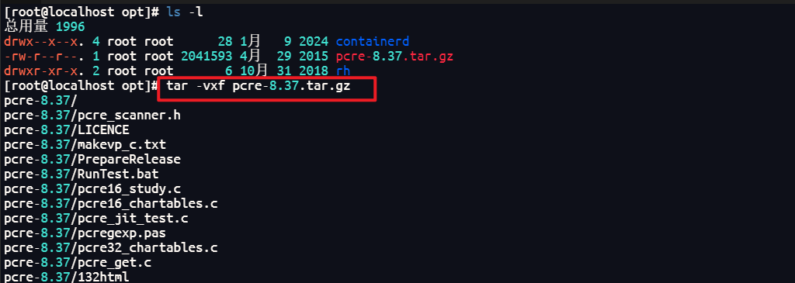

3、切换到解压后的目录内，执行`./configure`

```bash
cd pcre-8.37/
./configure
```

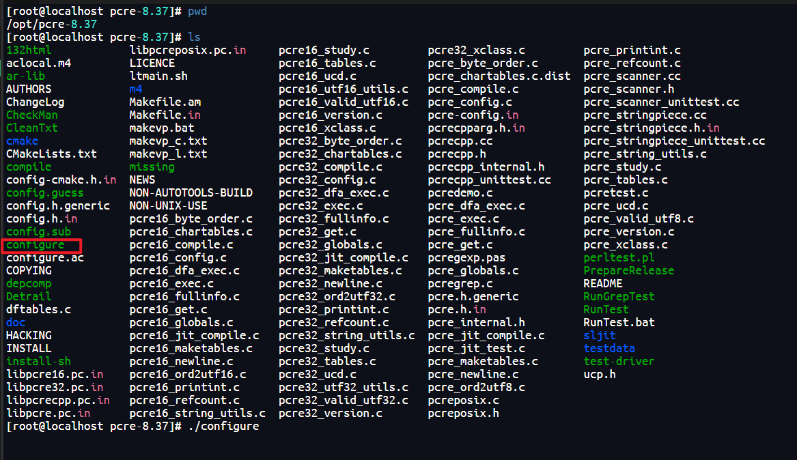

4、执行 `make && make install`进行编译及安装


5、安装好后可以用`pcre-config --version` 查看版本信息，校验是否安装成功


### 第二步，安装其他依赖

```bash
yum -y install make zlib zlib-devel gcc-c++ libtool openssl openssl-devel

# 一键安装四个依赖
#yum -y install gcc zlib zlib-devel pcre-devel openssl openssl-devel
```

如果提示下载依赖失败可再次尝试单独安装zlib 库


命令如下

```bash
sudo yum install zlib zlib-devel
```


### 第三步，安装Nginx

1、解压Nginx安装包

```bash
tar -xvf nginx-1.12.2.tar.gz 
```

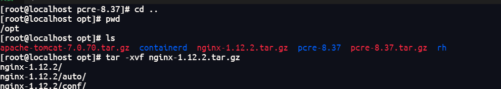

2、进入解压缩目录，执行`./configure`


若此处提示缺少zlib库则需按照上述步骤尝试单独安装zlib库


3、执行 `make && make install`进行编译及安装

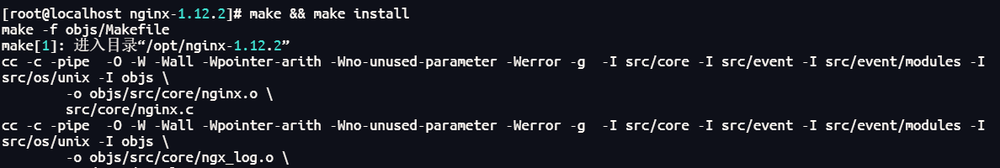

此时 `/usr/local`目录下会生成nginx文件夹


4、切换到`sbin`目录，执行`./nginx` 启动nginx


可以查看下是否有nginx进程

```bash
ps -ef | grep nginx
```


4、访问nginx，nginx默认端口为80，直接访问虚拟机或云服务器ip，注意配置防火墙

> 查看开放的端口号
> firewall-cmd --list-all
>
> 设置开放的端口号
> firewall-cmd--add-service=http-permanent
> sudo firewall-cmd--add-port=80/tcp--permanent
>
> 重启防火墙
> firewall-cmd -reload
>
> 查看防火墙状态
>
> sudo systemctl status firewalld
>
> 停止防火墙
>
> sudo systemctl stop firewalld
>
> 禁用防火墙
>
> sudo systemctl disable firewalld


# Nginx常用命令

> 使用nginx操作命令前提条件：必须进入nginx的目录
>
> /usr/local/nginx/sbin

## 查看版本号

```bash
./nginx -v
nginx version: nginx/1.12.2
```

## 启动Nginx

```bash
./nginx
```

## 关闭Nginx

```bash
./nginx -s stop
```

## 重新加载

> 例如修改配置文件时重新加载

```bash
./nginx -s reload
```


# Nginx配置文件

## 存放位置

> Nginx配置文件目录：/usr/local/nginx/conf/nginx.conf

nginx安装目录下，其默认的配置文件都放在这个目录的conf目录下，而主配置文件`nginx.conf`也在其中，后续对nginx的使用基本上都是对此配置文件进行相应的修改。

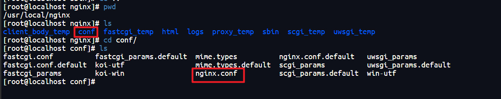

## 组成部分

配置文件中有很多`#`开头的表示注释内容，我们去掉所有以`#`开头的段落，精简之后的内容如下：

```
worker_processes  1;


events {
    worker_connections  1024;
}


http {
    include       mime.types;
    default_type  application/octet-stream;

    

    sendfile        on;
  
    keepalive_timeout  65;

   
    server {
        listen       80;
        server_name  localhost;

       
        location / {
            root   html;
            index  index.html index.htm;
        }

       
        error_page   500 502 503 504  /50x.html;
        location = /50x.html {
            root   html;
        }

     
    }

}
```


根据上述文件，我们可以很明显的将nginx.conf配置文件分为三部分: 全局块，events块，http块。

### 第一部分：全局块

从配置文件开始到events块之间的内容，<font color = 'red'>主要会设置一些影响nginx服务器整体运行的配置指令</font>，主要包括配
置运行Nginx服务器的用户（组）、允许生成的worker process数，进程PID存放路径、日志存放路径和类型以
及配置文件的引入等。

比如上面第一行配置的：

```bash
worker_processes  1;
```

这是Nginx服务器并发处理服务的关键配置，`worker_processes`值越大，可以支持的并发处理量也越多，但是
会受到硬件、软件等设备的制约.

### 第二部分：events块

events块涉及的指令主要影响<font color = 'red'>Nginx服务器与用户的网络连接</font>，常用的设置包括是否开启对多work process下的网络连接进行序列化，是否允许同时接收多个网络连接，选取哪种事件区动模型来处理连接请求，每个wod process可以同时支持的最大连接数等。这部分的配置对Ngix的性能影响较大，在实际中应该灵活配置。

例如下面的配置表示每个work process支持的最大连接数为1024

```bash
worker_connections  1024;
```

### 第三部分：http块

Nginx服务器配置中最频繁的部分，代理、缓存和日志定义等绝大多数功能和第三方模块的配置都在这里。
**需要注意的是：<font color = 'red'>http块也可以包括http全局块、server块。</font>**

#### http全局块

http全局块配置的指令包括文件引入、`MIME-TYPE`定义、日志自定义、连接超时时间、单链接请求数上限等。

#### server块

这块和虚拟主机有密切关系，虚拟主机从用户角度看，和一台独立的硬件主机是完全一样的，该技术的产生是为了
节省互联网服务器硬件成本。

**<font color = 'red'>每个http块可以包括多个server块，而每个server块就相当于一个虚拟主机。</font>**
**<font color = 'red'>每个server块也分为全局server块，以及可以同时包含多个locaton块。</font>**

##### 1、全局server块

最常见的配置是本虚拟机主机的监听配置和本虚拟主机的名称或IP配置。

##### 2、location块

一个server块可以配置多个location块。
这块的主要作用是基于Nginx服务器接收到的请求字符串（例如server_.name/uri-string),对虚拟主机名称
(也可以是P别名)之外的字符串（例如前面的ui-string)进行匹配，对特定的请求进行处理。地址定向、数据缓
存和应答控制等功能，还有许多第三方模块的配置也在这里进行。

# Nginx配置实例：反向代理

## 反向代理实例一

> 实现效果：使用ngnx反向代理，访问`www.123.com` 直接跳转到`127.0.0.1:8080`

### 环境准备

1、检查java环境，默认情况下，系统自带一个java环境

```bash
java --version
```


2、上传或下载tomcat安装包并解压


3、启动tomcat服务，进入tomcat bin目录，执行 `./startup.sh`命令

```bash
cd bin
./startup.sh
```

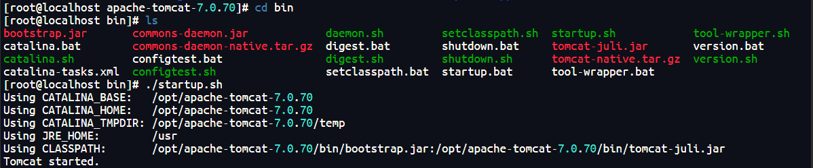

可以切换到logs目录，使用`tail -f catalina.out` 查看执行日志

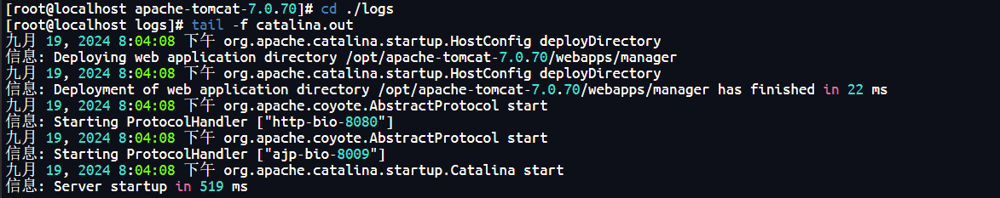

4、访问tomcat，注意配置防火墙

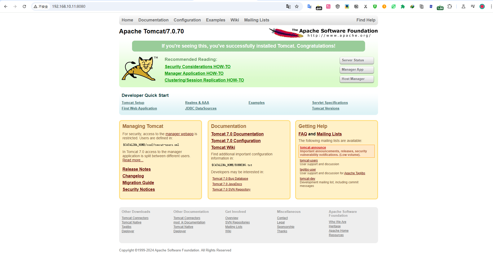

### 访问过程分析


我们希望访问`www.123.com`后能够请求到本地tomcat服务，我们对外仅暴露Nginx服务即代理服务器，Nginx服务器自动拦截`www.123.com`这个请求并将其转发到本地的tomcat服务地址。

我们还需要对`www.123.com`这个域名进行处理，使访问该域名时将请求发送到Nginx反向代理服务器

我们在浏览器访问某个域名时，执行过程是先到本地`hosts`查找有无相应配置，没有的话再通过DNS域名解析器，所以我们还需要通过修改本地`hosts`文件，将`www.123.com`映射到Nginx服务所在的主机上

**说明：因为`www.123.com`并非我们自己的域名，我们为了能够将请求发送到Nginx服务器，所以需要通过`hosts`做映射，这并非反向代理配置所需的步骤，反向代理时客户实际是无感知的，不需要做任何配置。**

### 具体配置步骤

**第一步：在Windows系统的`hosts`文件中进行IP对应关系配置**

`hosts`存放目录： `C:\Windows\System32\drivers\etc`

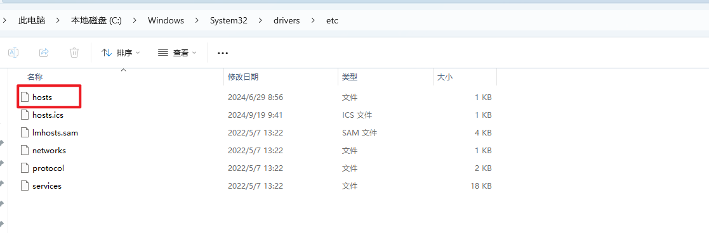

需要添加Nginx主机和域名的映射关系

```bash
192.168.10.11 www.123.com
```

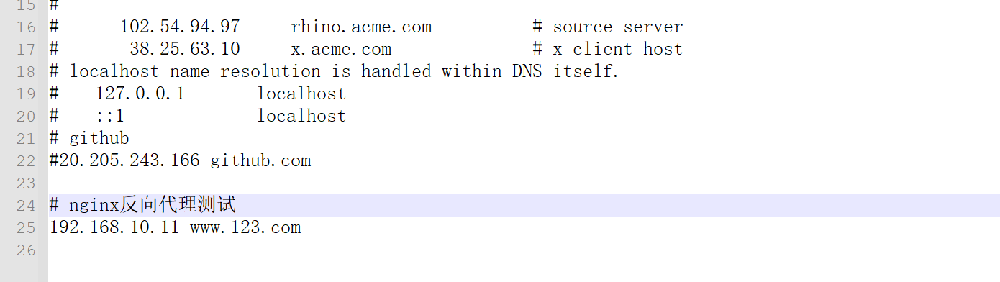

配置好后，我们访问访问`www.123.com`能够请求到Nginx服务，接下来需要再配置反向代理


第二步：在nginx进行请求转发的配置（反向代理配置）

> 注意此处修改的是 /usr/local/nginx/conf/redis.conf
>
> 不是nginx安装目录下的redis.conf

修改`nginx.conf` 中 `server`中配置

1、修改`server_name`为虚拟机或云服务器主机IP，默认为`localhost`

2、在`location`块中添加`proxy_pass`配置，请求转发地址为tomcat服务地址

这个配置的作用就是当我们访问nginx服务地址（默认监听的80端口）时将请求转发到tomcat服务地址(即8080端口)

```bash
server {
        listen       80;
        server_name  192.168.10.11;

        location / {
            root   html;
            proxy_pass http://127.0.0.1:8080;
            index  index.html index.htm;
        }
    }
```
详细配置如图所示：
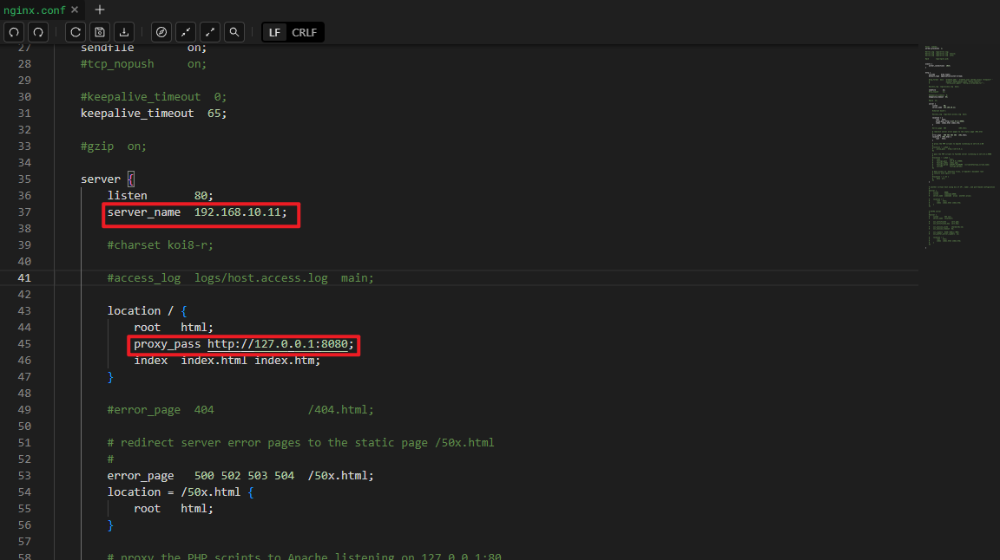

修改配置后重新加载nginx服务

```bash
cd /usr/local/nginx/sbin
./nginx -s reload
```

此时我们便可以通过`www.123.com`访问到Tomcat初始界面。

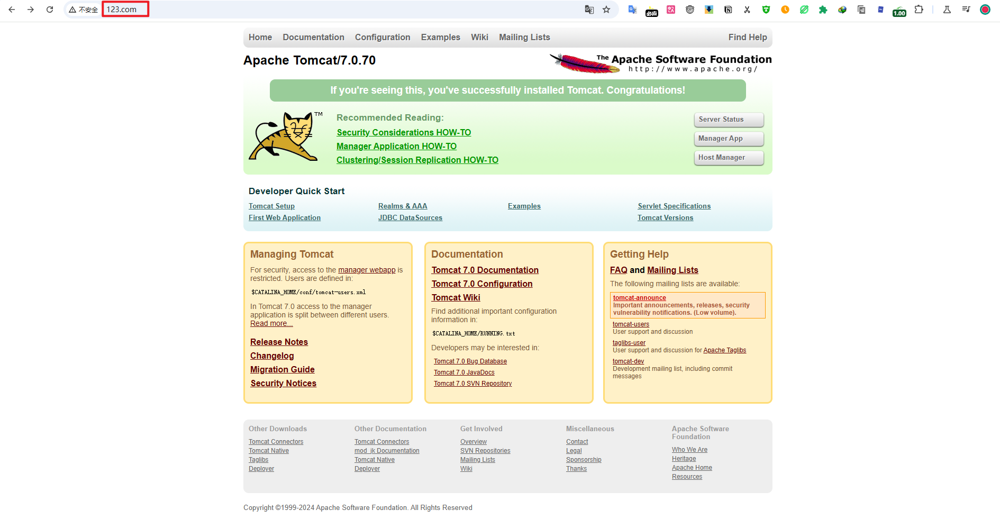

## 反向代理实例二

> 实现效果：使用nginx反向代理，根据访问的路径跳转到不同端口的服务中
> nginx监听端口为9001，
> 访问http:/127.0.0.1:9001/edu/直接跳转到127.0.0.1:8081
> 访问http:/127.0.0.1:9001/vod/直接跳转到127.0.0.1:8082

### 准备工作

1、准备两个tomcat服务器，一个8080端口，一个8081端口

```bash
# 切换到tomcat文件夹所在目录
cd /opt
# 重新创建两个文件夹分别存放两个tomcat
mkdir tomcat8080
mkdir tomcat8081
# 将原来的tomcat文件移动到 tomcat8080
mv ./apache-tomcat-7.0.70/* ./tomcat8080
# 复制一份到tomcat8081
cp -r ./tomcat8080/* ./tomcat8081
```

修改`server.xml`配置tomcat8081端口号信息

```xml
<Server port="8015" shutdown="SHUTDOWN">
    
    <Connector port="8081" protocol="HTTP/1.1"
               connectionTimeout="20000"
               redirectPort="8443" />
    
    <Connector port="8019" protocol="AJP/1.3" redirectPort="8443" />
```

配置好后同时启动两个tomcat

2、创建文件夹和测试页面

```bash
# 创建文件目录
mkdir -p /opt/tomcat8080/webapps/edu
mkdir -p /opt/tomcat8081/webapps/vod
# 创建静态文件
echo "<h1>Hello Tomcat8080</h1>" > /opt/tomcat8080/webapps/edu/index.html
echo "<h1>Hello Tomcat8081</h1>" > /opt/tomcat8081/webapps/vod/index.html
```

访问测试一下


### 具体配置步骤

1、在`nginx.conf`http块中新增配置

```bash
server {
        listen       9001;
        server_name  192.168.10.11;

        location ~ /edu/ {
            proxy_pass http://localhost:8080;
        }

        location ~ /vod/ {
            proxy_pass http://localhost:8081;
        }
    }
```

2、开放访问端口 `9001` ，`8080` ， `8081`

3、重新加载nginx

```bash
cd /usr/local/nginx/sbin
./nginx -s reload
```

4、测试


## location指令说明

该指令用于匹配URL，语法如下：

```bash
location [= | ~ | ~* | ^~] uri {

}
```

1、`=`：用于不含正则表达式的uri前，要求请求字符串与uri严格匹配，如果匹配成功，就停止继续向下搜索并立即处理该请求。
2、 `~` : 用于表示uri包含正则表达式，并且区分大小写。
3、` ~*`: 用于表示uri包含正则表达式，并且不区分大小写。
4、`^~`: 用于不含正则表达式的uri前，要求Nginx服务器找到标识uri和请求字符串匹配度最高的location后，立即使用此location处理请求，而不再使用location块中的正则uri和请求字符串做匹配。

<font color = 'red'>**注意：如果uri包含正则表达式，则必须要有 `~` 或者` ~*`标识。**</font>

# Nginx配置实例：负载均衡

> 实现效果：
>
> 浏览器地址栏输入地址http:/192.168.17.129/edu/,负载均衡效果，平均8080和8081端口中

## 负载均衡实例

1、准备两台tomcat服务器，一台8080，一台8081
2、在两台tomcat里面webapps目录中，创建名称为`edu`的文件夹，在`edu`文件夹中创建页面`index.html`

由于之前8080端口的这台已经配置好了，所以再复制一份到8081并修改页面内容

```bash
# 创建tomcat8081 文件所需目录
mkdir -p /opt/tomcat8081/webapps/edu
# 复制tomcat8080文件到tomcat8081
cp -r /opt/tomcat8080/webapps/edu/* /opt/tomcat8081/webapps/edu
# 修改tomcat8081页面显示内容
echo "<h1>Hello Tomcat8081</h1>" > /opt/tomcat8081/webapps/edu/index.html
```

3、修改`nginx.conf`文件，添加负载均衡配置

> 注意路径为`/usr/local/nginx/conf/nginx.conf`，而非安装目录下的配置文件

```bash
upstream myserver {
	server 192.168.10.11:8080;
	server 192.168.10.11:8081;
}

server {
        listen       80;
        server_name  192.168.10.11;
        
        location / {
            root   html;
            proxy_pass http://myserver;
            index  index.html index.htm;
        }

    }
```
详细配置如下：
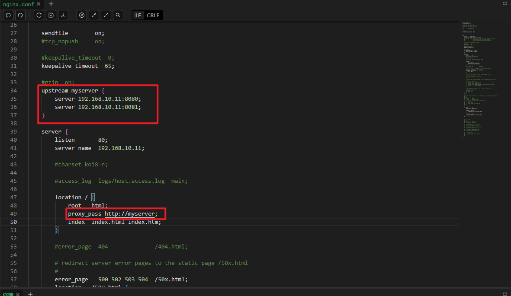

4、重载nginx服务

```bash
cd /usr/local/nginx/sbin
./nginx -s reload
```

5、测试


## Nginx分配服务器策略

随着互联网信息的爆炸性增长，负载均衡(load balance)己经不再是一个很陌生的话题，顾名思义，负载均衡即是将负载分摊到不同的服务单元，既保证服务的可用性，又保证响应足够快，给用户很好的体验。快速增长的访问量和数据流量催生了各式各样的负载均衡产品，很多专业的负载均衡硬件提供了很好的功能，但却价格不菲，这使得负载均衡软件大受欢迎，nginx就是其中的一个，在linux下有Nginx、LVS、Haproxy等等服务可以提供负载均衡服务，而且Nginx提供了几种分配方式（策略）：

1、**轮询**（默认)
每个请求按时间顺序逐一分配到不同的后端服务器，如果后端服务器down掉，能自动剔除。
2、**weight**
weight代表权重，默认为1，权重越高被分配的客户端越多
指定轮询几率，weight和访问比率成正比，用于后端服务器性能不均的情况。例如：

```bash
upstream myserver {
        server 192.168.10.11:8080 weight=5;
        server 192.168.10.11:8081 weight=10;
    }
```

3、ip_hash

每个请求按访问ip的hash结果分配，这样每个访客固定访问一个后端服务器，可以解决session的问题。例如：

```bash
upstream myserver {
		ip_hash;
        server 192.168.10.11:8080;
        server 192.168.10.11:8081;
    }
```

4、fair(第三方)

按后端服务器的响应时间来分配请求，响应时间短的优先分配。

```bash
upstream myserver {
        server 192.168.10.11:8080;
        server 192.168.10.11:8081;
        fair;
    }
```

# Nginx配置实例：动静分离

## 相关介绍

Ngix动静分离简单来说就是把动态跟静态请求分开，不能理解成只是单纯的把动态页面和静态页面物理分离。<font color = 'red'>严格意义上说应该是动态请求跟静态请求分开</font>，可以理解成使用Nginx处理静态页面，Tomcat处理动态页面。

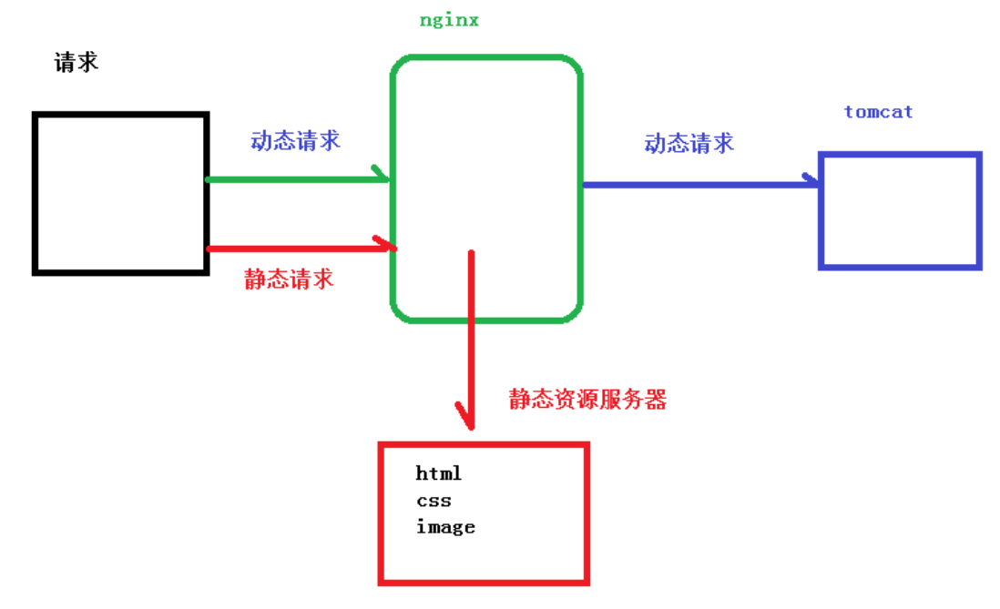

### 动静分离处理方式

动静分离从目前实现角度来讲大致分为两种。

一种是纯粹把静态文件独立成单独的域名，放在独立的服务器上，也是目前主流推崇的方案：
另外一种方法就是动态跟静态文件混合在一起发布，通过nginx来分开。

通过`location`指定不同的后缀名实现不同的请求转发。通过`expires`参数设置，可以使浏览器缓存过期时间，减少与服务器之前的请求和流量。

### Expires配置介绍

即给一个资源设定一个过期时间，也就是说无需去服务端验证，直接通过浏览器自身确认是否过期即可，所以不会产生额外的流量。此种方法非常适合不经常变动的资源。（如果经常更新的文件，不建议使用Expires来缓存)，例如我这里设置为3d，表示在这3天之内访问这个URL，每发送一个请求，都会比对服务器上该文件最后更新时间有没有变化，没变化则不会从服务器抓取，返回状态码304；如果有修改，则直接从服务器重新下载，返回状态码200。

## 动静分离实例

### 准备工作

在Liunx系统中准备静态资源，用于进行访问

```bash
# 创建相关目录
mkdir -p /data/www
mkdir -p /data/image
# 在www目录放一个静态页面
echo "<h1>Hello World!!</h1>" > /data/www/index.html
# 在image目录放一张图片 手动上传即可
```

### 具体配置步骤

1、修改`nginx.conf`配置文件，添加请求转发配置

> 注意路径为`/usr/local/nginx/conf/nginx.conf`，而非安装目录下的配置文件

`autoindex on` 的作用是列出文件夹中的内容，`root` 用于指定静态文件所在的根目录

```bash
server {
        listen       80;
        server_name  192.168.10.11;

        location /www/ {
            root /data/;
            index index.html index.htm;
        }

        location /image/ {
            root /data/;
            autoindex on;
        }
    }
```

详细配置如图所示：

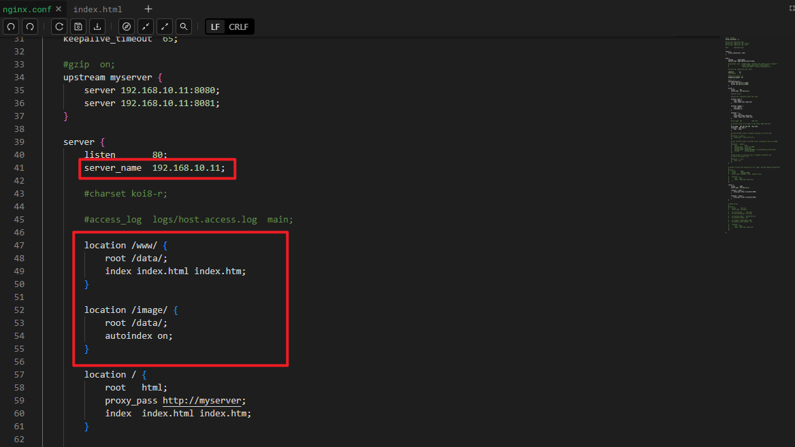

2、重载nginx服务

```bash
cd /usr/local/nginx/sbin
./nginx -s reload
```

3、测试，浏览器直接访问相关路径即可

访问图片资源目录


访问图片资源


访问静态页面


# Nginx配置高可用的集群

## Keepalived-+Nginx高可用集群（主从模式）

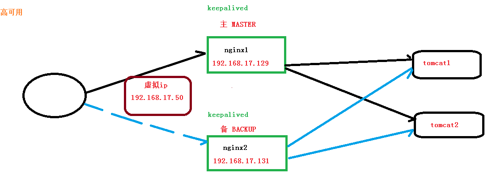

### 配置步骤

**1、需要两台服务器**
**2、在两台服务器安装nginx，若非重新安装注意恢复配置文件到默认状态**
**3、在两台服务器安装`keepalived`**

```bash
yum install keepalived -y
```

> 若找不到镜像可尝试更改npm镜像源，比如阿里云镜像，或者手动下载
>
> 可参考文章: [解决【Could not retrieve mirrorlist】问题及 YUM 镜像源配置](https://blog.shiguang666.eu.org/2024/09/19/53c5980f1822/)

安装之后，在etc里面生成目录keepalived,有文件`keepalived.conf`

**4、完成高可用配置（主从配置）**

修改`/etc/keepalived/keepalivec.conf` 配置文件，修改时注意虚拟IP应和主机位于相同网络环境下

主机配置

```bash
## 192.168.10.11 Master

global_defs {
   notification_email {
     acassen@firewall.loc
     failover@firewall.loc
     sysadmin@firewall.loc
   }
   notification_email_from Alexandre.Cassen@firewall.loc
   smtp_server 192.168.10.11
   smtp_connect_timeout 30
   router_id LVS_DEVEL
}

# 定义一个 vrrp_script 块来执行脚本
vrrp_script chk_http_port {
    script "/usr/local/src/nginx_check.sh"
    interval 2  # 检测脚本执行的间隔
    weight 2
}

vrrp_instance VI_1 {
    state MASTER  # 备份服务器上将 MASTER 改为 BACKUP
    interface ens33  # 网卡
    virtual_router_id 51  # 主、备机的 virtual_router_id 必须相同
    priority 100  # 主、备机取不同的优先级，主机值较大，备份机值较小
    advert_int 1

    authentication {
        auth_type PASS
        auth_pass 1111
    }

    virtual_ipaddress {
        192.168.10.50  # VRRP H 虚拟地址
    }

    # 引用 vrrp_script 块
    track_script {
        chk_http_port
    }
}
```

从机配置

```bash
## 192.168.10.22 BACKUP

global_defs {
   notification_email {
     acassen@firewall.loc
     failover@firewall.loc
     sysadmin@firewall.loc
   }
   notification_email_from Alexandre.Cassen@firewall.loc
   smtp_server 192.168.10.22
   smtp_connect_timeout 30
   router_id LVS_DEVEL
}

# 定义一个 vrrp_script 块来执行脚本
vrrp_script chk_http_port {
    script "/usr/local/src/nginx_check.sh"
    interval 2  # 检测脚本执行的间隔
    weight 2
}

vrrp_instance VI_1 {
    state BACKUP  # 备份服务器上将 MASTER 改为 BACKUP
    interface ens33  # 网卡
    virtual_router_id 51  # 主、备机的 virtual_router_id 必须相同
    priority 80  # 主、备机取不同的优先级，主机值较大，备份机值较小
    advert_int 1

    authentication {
        auth_type PASS
        auth_pass 1111
    }

    virtual_ipaddress {
        192.168.10.50  # VRRP H 虚拟地址
    }

    # 引用 vrrp_script 块
    track_script {
        chk_http_port
    }
}
```

在`/usr/local/src` 添加检测脚本`nginx_check.sh`

这个脚本文件是一个用于监控Nginx服务状态的Bash脚本。它的主要功能是检查Nginx进程是否在运行，如果Nginx进程不存在，则尝试重新启动Nginx。如果重新启动失败，则终止Keepalived进程。以下是脚本的详细解释：

**脚本内容**

```bash
#!/bin/bash
A=`ps -C nginx --no-header |wc -l`
if [ $A -eq 0 ];then
    /usr/local/nginx/sbin/nginx
    sleep 2
    if [ `ps -C nginx --no-header |wc -l` -eq 0 ];then
        killall keepalived
    fi
fi
```

**脚本解释**

1. **第一行**：`#!/bin/bash`
   - 这是一个Shebang行，指定脚本使用Bash解释器执行。

2. **第二行**：`A=`ps -C nginx --no-header |wc -l``
   - 这行命令使用 `ps -C nginx --no-header` 来检查Nginx进程是否在运行。`--no-header` 选项表示不显示表头，只显示进程信息。
   - `wc -l` 用于统计输出行数，即Nginx进程的数量。
   - 最终，`A` 变量存储了Nginx进程的数量。

3. **第三行**：`if [ $A -eq 0 ];then`
   - 这是一个条件判断语句，检查 `A` 是否等于0。如果等于0，表示Nginx进程不存在。

4. **第四行**：`/usr/local/nginx/sbin/nginx`
   - 如果Nginx进程不存在，则尝试重新启动Nginx。`/usr/local/nginx/sbin/nginx` 是Nginx的启动命令。

5. **第五行**：`sleep 2`
   - 等待2秒钟，给Nginx启动的时间。

6. **第六行**：`if [ `ps -C nginx --no-header |wc -l` -eq 0 ];then`
   - 再次检查Nginx进程是否在运行。如果Nginx进程仍然不存在，则执行下一步。

7. **第七行**：`killall keepalived`
   - 如果Nginx进程仍然不存在，则终止Keepalived进程。`killall keepalived` 命令会终止所有名为 `keepalived` 的进程。

这个脚本的主要目的是确保Nginx服务在出现故障时能够自动重启。如果Nginx重启失败，则终止Keepalived进程，可能是为了触发高可用性（HA）机制，例如切换到备用服务器。

**注意事项**

- 确保脚本具有执行权限：`chmod +x /path/to/your/script.sh`
- 确保Nginx和Keepalived的安装路径正确。
- 这个脚本可以作为一个简单的监控脚本，但更复杂的监控和自动恢复机制可能需要使用更高级的工具，如 `monit` 或 `supervisor`。

**5、分别启动两台机器nginx和keepalived服务**

启动keepalived的命令如下

```bash
systemctl start keepalived.service
```

**6、测试**

在浏览器访问配置的虚拟IP地址，此处我配置的为`192.168.10.50`


停止一台机器的keepalived服务，重新访问依旧正常，说明集群配置成功

使用命令`ip a`可以看到ens33网卡上绑定了我们配置的虚拟ip地址

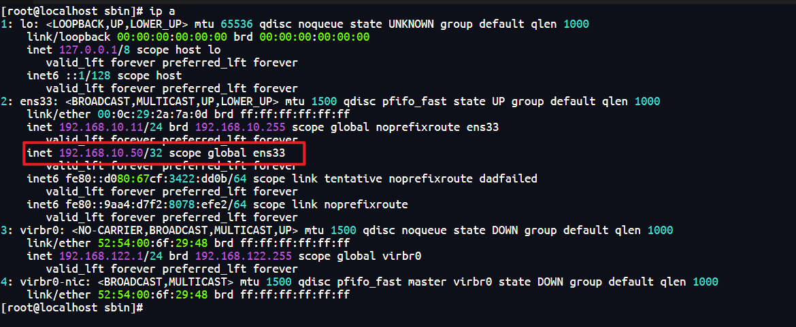

# Nginx原理与优化参数配置

## Master-Worker 机制概述
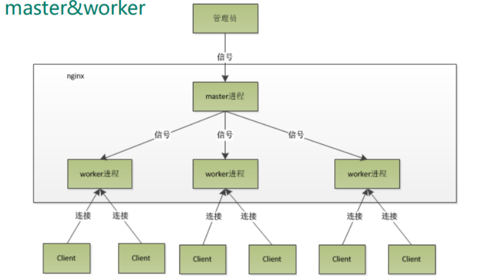

Nginx 采用了一种称为 Master-Worker 的多进程架构，这种架构设计使得 Nginx 能够高效地处理并发请求，并且具有良好的稳定性和可扩展性。通过 Master 进程管理和监控 Worker 进程，Nginx 能够处理大量并发请求，并且具有良好的容错能力和热更新能力。这种设计使得 Nginx 成为处理高并发 Web 请求的理想选择。以下是 Nginx 的 Master-Worker 机制的详细介绍：

#### **Master 进程**

**角色**：Master 进程是 Nginx 的主进程，负责管理和监控 Worker 进程。

**功能**：
- 加载配置文件。
- 创建和监控 Worker 进程。
- 处理信号（如重新加载配置、平滑重启等）。
- 管理 Worker 进程的生命周期（启动、停止、重启）。

#### **Worker 进程**

**角色**：Worker 进程是实际处理客户端请求的进程。

**功能**：
- 处理客户端的连接和请求。
- 与后端服务器进行通信（如反向代理、负载均衡）。
- 处理请求的上下文（如读取请求体、发送响应等）。

#### **工作流程**
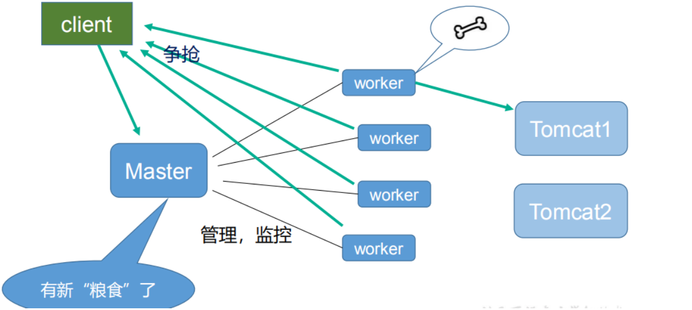

**启动阶段**

- Nginx 启动时，Master 进程首先加载配置文件并解析配置。
- Master 进程根据配置文件中的 `worker_processes` 指令创建相应数量的 Worker 进程。

**运行阶段**

- Worker 进程在启动后进入事件循环，监听并处理来自客户端的连接请求。
- 每个 Worker 进程独立处理连接，互不干扰，从而实现高并发处理能力。

**信号处理**

Master 进程负责处理各种信号，如：
- `SIGHUP`：重新加载配置文件。
- `SIGTERM`：平滑关闭 Nginx。
- `SIGUSR1`：重新打开日志文件。
- `SIGUSR2`：平滑升级 Nginx 二进制文件。

当 Master 进程接收到重新加载配置的信号时，它会重新加载配置文件并通知 Worker 进程重新加载配置。

**Worker 进程管理**
- Master 进程监控 Worker 进程的状态，如果某个 Worker 进程异常退出，Master 进程会重新创建一个新的 Worker 进程。
- 这种机制确保了 Nginx 的高可用性和稳定性。

#### 配置示例

以下是一个典型的 Nginx 配置示例，展示了 Master-Worker 机制的相关配置：

```nginx
# 定义工作进程数，通常设置为 CPU 核心数
worker_processes auto;

# 定义每个工作进程的最大连接数
events {
    worker_connections 1024;
}

# HTTP 配置
http {
    # 其他 HTTP 配置项
    server {
        listen 80;
        server_name example.com;

        location / {
            proxy_pass http://backend_server;
        }
    }
}
```


## master-workers的机制的好处

首先，对于每个worker进程来说，独立的进程，不需要加锁，所以省掉了锁带来的开销，同时在编程以及问题查找时，也会方便很多。其次，采用独立的进程，可以让互相之间不会影响，一个进程退出后，其它进程还在工作，服务不会中断，master进程则很快启动新的worker进程。当然，worker进程的异常退出，肯定是程序有bug了，异常退出，会导致当前worker上的所有请求失败，不过不会影响到所有请求，所以降低了风险。


**高并发处理能力**

多个 Worker 进程可以并行处理客户端请求，充分利用多核 CPU 的性能。

**稳定性**

即使某个 Worker 进程崩溃，Master 进程可以重新创建一个新的 Worker 进程，确保服务的持续可用性。

**热更新**

通过信号机制，可以在不中断服务的情况下重新加载配置文件或升级 Nginx 二进制文件。

**资源隔离**

每个 Worker 进程独立运行，互不干扰，避免了进程间资源竞争的问题。


## 一个master和多个woker有好处

1、可以使用`nginx-s reload`热部署，利用nginx进行热部署操作，空闲的worker会自动进行加载。
2、每个woker是独立的进程，如果有其中的一个woker出现问题，其他woker独立的，继续进行争抢，实现请求过程，不会造成服务中断。

## 需要设置多少个worker

Nginx同redis类似都采用了io多路复用机制，每个worker都是一个独立的进程，但每个进程里只有一个主线程，通过异步非阻塞的方式来处理请求，即使是千上万个请求也不在话下。每个worker的线程可以把一个cpu的性能发挥到极致。<font color = 'red'>所以worker数和服务器的cpu数相等是最为适宜的</font>。设少了会浪费cpu,设多了会造成cpu频繁切换上下文带来的损耗。


```bash
#设置worker数量。
worker_processes 4
#work绑定cpu(4work绑定4cpu)。
worker_cpu_affinity 0001 0010 0100 1000

#work绑定cpu(4work绑定8cpu中的4个)。
worker_cpu_affinity 0000001 00000010 00000100 00001000
```

## 连接数worker_connection

**问题一：发送请求，占用了woker的几个连接数？**
**答案：2或者4个**

只访问静态资源占用两个连接数（从客户端到服务端请求，从服务端到客户端响应）

访问动态资源或者反向代理占用四个连接数（访问后端服务（如Tomcat）请求和响应额外消耗两个连接数）

**问题二：nginx有一个master和四个woker，每个woker支持最大的连接数1024，支持的最大并发数是多少？**
1、普通的静态访问最大并发数是：`worker_connections * worker_processes /2`

2、如果是 HTTP 作 为反向代理来说，最大并发数量应该是 `worker_connections * worker_processes/4`
